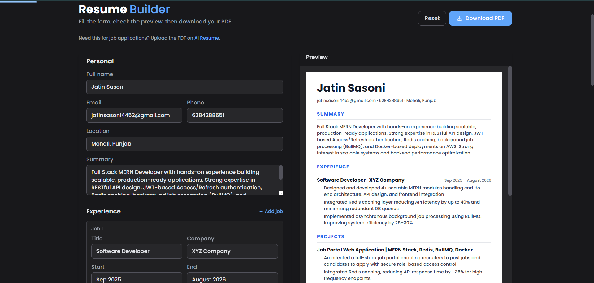
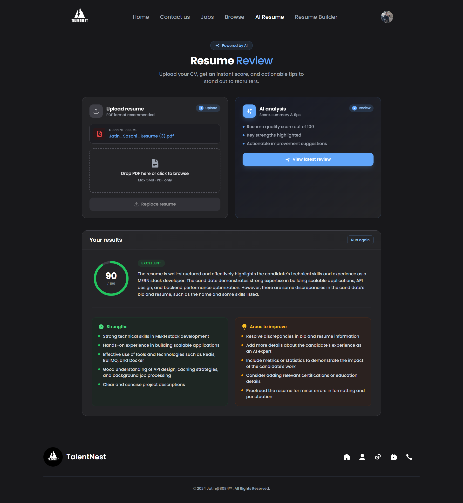
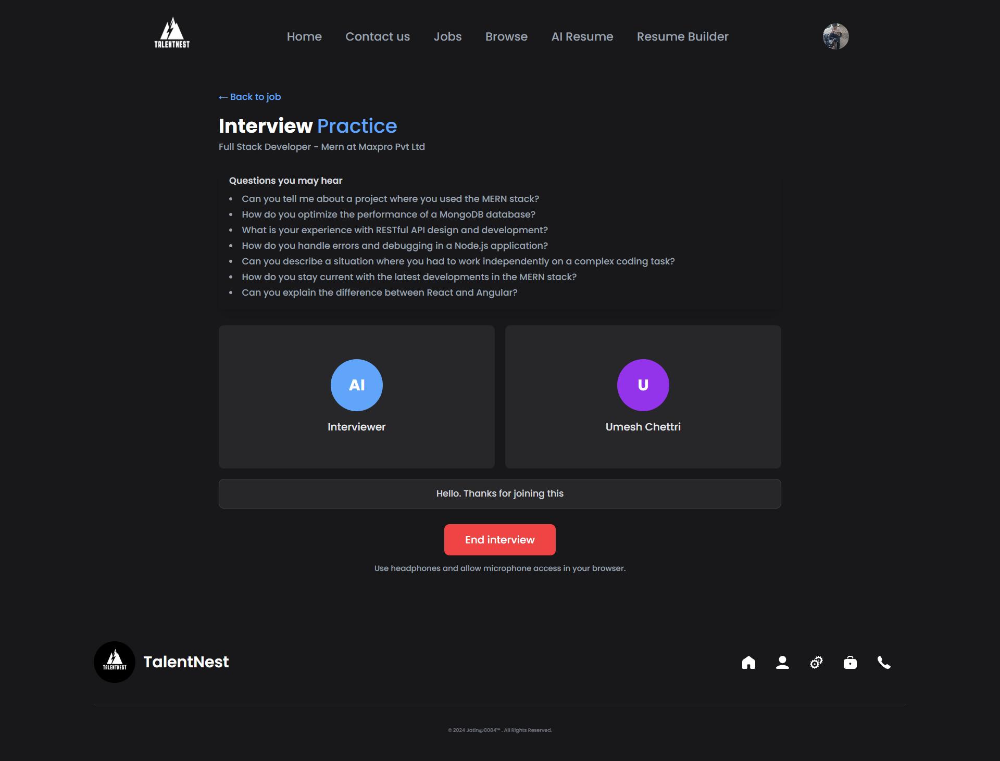
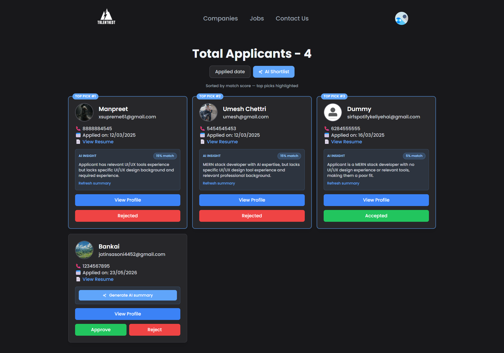

# TalentNest Pro — MERN Job Portal

A full-stack job portal that connects **students (job seekers)** and **recruiters**. Built with the MERN stack, plus AI features (Google Gemini), voice interview practice (Vapi), payments (Razorpay), and background email jobs (BullMQ + Redis).

---

## Live preview

> Both frontend and backend may be hosted on serverless platforms. Cold starts can add a few seconds to the first load.

**Preview:** [https://talentnests.duckdns.org/](https://talentnests.duckdns.org/)

## Screenshots







---

## Features

### Job seekers (students)

| Feature | Description |
|--------|-------------|
| Job search & filters | Salary, location, experience, job type |
| One-click apply | Apply from job detail page; resume from profile |
| Application tracking | View applied jobs and status |
| **AI Resume Review** | Upload PDF (drag & drop), get score, summary, strengths & improvements |
| **Resume Builder** | Form-based CV, live preview, download PDF (local draft in `localStorage`) |
| **Interview practice** | Per-job voice mock interview (Vapi) + AI feedback report |
| Saved jobs | Bookmark jobs for later |
| Email updates | Notified when application status changes |

### Recruiters

| Feature | Description |
|--------|-------------|
| Companies & jobs | Create and manage companies and postings |
| Applicant management | View applicants, accept/reject, download resume |
| **AI job description** | Generate description & requirements (subscription) |
| **AI applicant summary** | One-line summary + match score from resume PDF (subscription) |
| **AI shortlist** | Sort applicants by match score |
| Razorpay subscription | Unlock recruiter AI tools |
| Job of the day | Featured job placement |

### Platform

- JWT auth (HTTP-only cookies)
- Cloudinary for resumes, profile photos, company logos
- Redis caching for job listings (optional; app works if Redis is down)
- BullMQ email queue (welcome, apply, status, OTP) with safe fallback if queue fails
- Responsive UI — React 19, Tailwind CSS, Framer Motion

---

## Tech stack

| Layer | Technologies |
|-------|----------------|
| Frontend | React 19, Vite, Redux Toolkit, Redux Persist, React Router 7, Tailwind, Motion, Axios, React Hook Form |
| Backend | Node.js, Express, Mongoose, JWT, Bcrypt, Multer, express-validator |
| AI | [Groq](https://groq.com) (default: `llama-3.3-70b-versatile`) via OpenAI-compatible API |
| Voice interviews | [Vapi](https://vapi.ai) (`@vapi-ai/web`) |
| PDF | `html2pdf.js` (resume export), `pdf-parse` (resume text for AI) |
| Data & infra | MongoDB, Redis (Upstash), BullMQ, Cloudinary, Razorpay, Nodemailer |

---

## Project structure

```
JOB PORTAL/
├── client/                 # React + Vite frontend
│   ├── public/env.js       # Runtime config (API URL, Razorpay, Vapi key)
│   └── src/
│       ├── pages/          # AiResumeReview, ResumeBuilder, Interview, etc.
│       ├── Components/
│       └── Api/
├── server/                 # Express API
│   ├── controller/         # User, Job, Application, AI, Company, Contact
│   ├── routes/
│   ├── models/
│   ├── middleware/
│   ├── queues/             # BullMQ email queue
│   └── utils/
└── screenshots/
```

---

## Getting started

### Prerequisites

- Node.js 18+
- MongoDB (Atlas or local)
- [Cloudinary](https://cloudinary.com) — file uploads
- [Razorpay](https://razorpay.com) — recruiter subscription (test keys OK for dev)
- [Groq Console](https://console.groq.com) — `AI_API_KEY` for AI features (or any OpenAI-compatible provider)
- [Vapi](https://dashboard.vapi.ai) — public API key for interview practice (client)
- [Upstash Redis](https://upstash.com) (optional) — caching + email queue; free tier has daily limits

### 1. Clone & install

```bash
git clone https://github.com/JatinSasoni/Job-Portal.git
cd Job-Portal

cd server && npm install
cd ../client && npm install
```

### 2. Backend environment

Create `server/.env` (see `server/.env.example`):

```env
PORT=8000
MONGODB_URI=your_mongodb_connection_string
SECRET_KEY=your_jwt_secret

# Frontend URL for CORS
FRONTEND_URL=http://localhost:5173

# AI — Groq (see server/.env.example)
AI_API_KEY=your_groq_api_key
AI_BASE_URL=https://api.groq.com/openai/v1
AI_MODEL=llama-3.3-70b-versatile

# Cloudinary
CLOUD_NAME=
CLOUDINARY_API_KEY=
CLOUDINARY_API_SECRET=

# Email (SMTP used by queue worker)
COMPANY_NAME=TalentNest Pro
COMPANY_EMAIL=your_noreply@example.com

# Razorpay
RAZOR_PAY_KEY=
RAZOR_PAY_SECRET=
RAZOR_PLAN_ID=

# Redis (Upstash) — optional but recommended for cache + emails
REDIS_URL=your_upstash_redis_url
EMAIL_QUEUE_NAME=emailQueue
```

Start the API:

```bash
cd server
npm run dev
```

Server runs at `http://localhost:8000` by default.

### 3. Frontend environment

Edit `client/public/env.js` (loaded at runtime in the browser):

```js
window._env_ = {
  VITE_API_URI: "http://localhost:8000",
  VITE_RAZOR_PAY_KEY: "rzp_test_xxx",
  VITE_SUBSCRIPTION_PRICE: 10,
  VITE_VAPI_PUBLIC_API_KEY: "your_vapi_public_key",
};
```

Start the client:

```bash
cd client
npm run dev
```

App runs at `http://localhost:5173`.

> **Note:** The client uses `public/env.js`, not Vite `.env` files, for these values in this project.

---

## AI API overview

Base path: `/api/v1/ai` (authenticated unless noted)

| Method | Endpoint | Role | Notes |
|--------|----------|------|--------|
| POST | `/job-description/generate` | Recruiter + subscription | Job posting copy |
| POST | `/applicant/summary` | Recruiter + subscription | PDF resume → summary & match % |
| POST | `/resume/review` | Student | Profile resume → score & tips |
| POST | `/interview/job/:jobId/start` | Student | Create session + questions |
| GET | `/interview/session/:sessionId` | Student | Session / report |
| GET | `/interview/job/:jobId/history` | Student | Past attempts |
| POST | `/interview/session/:sessionId/feedback` | Student | Transcript → Gemini feedback |

**Model:** set via `AI_MODEL` (default `llama-3.3-70b-versatile`). All AI routes use JSON mode for reliable parsing. See [Groq rate limits](https://console.groq.com/docs/rate-limits).

**Interview practice:** Open a job → **Practice interview** → voice call via Vapi → feedback saved after the call. Mic permission and HTTPS (or localhost) required.

---

## Key routes (frontend)

| Path | Purpose |
|------|---------|
| `/jobs` | Browse jobs |
| `/description/:jobID` | Job detail & apply |
| `/description/:jobID/interview` | Voice practice |
| `/resume-review` | AI resume upload & review |
| `/resume-builder` | Build & download PDF |
| `/admin/*` | Recruiter dashboard |

---

## Scripts

| Location | Command | Description |
|----------|---------|-------------|
| `server/` | `npm run dev` | API with nodemon |
| `server/` | `npm start` | Production API |
| `client/` | `npm run dev` | Vite dev server |
| `client/` | `npm run build` | Production build |

---

## Deployment notes

- Configure `FRONTEND_URL` and CORS origins in `server/server.js` for your production domain.
- Set `client/public/env.js` (or inject at deploy) with production API URL and keys.
- **Do not commit** real API keys in `env.js` or `.env` — use secrets in your host dashboard.
- Redis quota exhaustion only affects cache/emails; core CRUD still works. Job apply uses safe email enqueue so applications are not orphaned.

---

## Author

**Jatin Sasoni**

---


